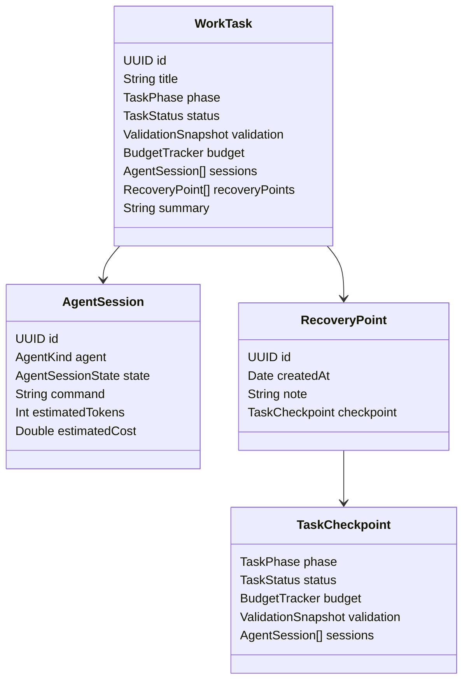

# ✨ feat: AgentOS Delivery Readiness Completion

## Overview
本计划用于继续实现 AgentOS，目标是把当前“可演示版本”提升为“可交付版本”：从本地 shell 模拟执行升级为真实可验证执行通道，并补齐决策治理、恢复治理、测试联动与交付指标闭环。

## Problem Statement
当前 AgentOS 已完成多面板 UI、任务生命周期、预算告警、决策中心、恢复中心和总结面板，且测试通过；但仍存在交付级缺口：
- 执行层主要依赖本地命令模拟，真实场景一致性不足。
- 阶段门、预算告警、恢复策略、审批权限缺少明确策略矩阵。
- 总结面板缺少可交付量化指标与导出链路。
- `docs/solutions/` institutional learnings 缺失，无法复用历史经验。

## Proposed Solution
以“三阶段交付收敛”推进：
1. 建立执行抽象层（模拟/真实双通道）并定义真实场景验证标准。
2. 完成治理中枢（审批权限、告警策略、失败分类与恢复策略）。
3. 打通验收闭环（测试联动、交付指标、导出报告、文档与操作手册）。

## Technical Approach

### Architecture
- 将执行能力从 `DashboardViewModel` 中抽象为 `ExecutionProvider` 协议，支持 `LocalShellProvider` 与 `ScenarioProvider`。
- 在任务生命周期中引入“策略驱动治理层”，统一预算阈值、审批规则、恢复动作。
- 将总结面板升级为“可交付报告面板”，输出结构化指标并支持导出。

### Data Model (Mermaid)

### Implementation Phases

#### Phase 1: Execution Readiness Foundation
- [x] `AgentOS/Sources/AgentOS/Services/ExecutionProvider.swift`：新增执行协议与事件映射。
- [x] `AgentOS/Sources/AgentOS/Services/LocalShellExecutionProvider.swift`：迁移当前 shell 执行逻辑。
- [x] `AgentOS/Sources/AgentOS/Services/ScenarioExecutionProvider.swift`：实现真实场景模拟器（网络延迟、超时、权限失败）。
- [x] `AgentOS/Sources/AgentOS/ViewModels/DashboardViewModel.swift`：接入 provider 注入与切换策略。
- [x] `AgentOS/Tests/AgentOSTests/ExecutionProviderTests.swift`：覆盖 provider 失败、超时、重试路径。

Success criteria:
- 同一任务可在“本地模式/场景模式”运行。
- 失败与审批事件映射一致，UI 无需分支判断。

#### Phase 2: Governance & Decision Matrix
- [x] `AgentOS/Sources/AgentOS/Models/GovernanceModels.swift`：新增审批角色、告警级别、恢复策略模型。
- [x] `AgentOS/Sources/AgentOS/Services/BudgetGuard.swift`：支持动态阈值与策略模板覆盖。
- [x] `AgentOS/Sources/AgentOS/ViewModels/DashboardViewModel.swift`：实现审批 quorum、超时 fallback、失败分类。
- [x] `AgentOS/Sources/AgentOS/Views/DecisionCenterView.swift`：展示“谁可批、剩余时间、默认动作”。
- [x] `AgentOS/Sources/AgentOS/Views/RecoveryPanelView.swift`：展示失败分类与推荐恢复动作。
- [x] `AgentOS/Tests/AgentOSTests/GovernanceFlowTests.swift`：覆盖审批拒绝、超时回退、冲突解决。

Success criteria:
- 每个决策点具备“触发条件 + 责任人 + 超时动作 + 审计记录”。
- 恢复动作可复现且可测试。

#### Phase 3: Delivery Evidence & Product Polish
- [x] `AgentOS/Sources/AgentOS/Views/SummaryPanelView.swift`：增加交付指标卡片（恢复时长、预算偏差、测试通过率）。
- [x] `AgentOS/Sources/AgentOS/Services/ReportExporter.swift`：导出 Markdown/JSON 报告。
- [x] `AgentOS/Sources/AgentOS/Views/TaskDetailView.swift`：新增快捷键提示与关键路径无鼠标操作。
- [x] `AgentOS/Tests/AgentOSTests/DeliveryReportTests.swift`：校验报告字段与统计准确性。
- [x] `docs/operations/2026-02-15-agentos-delivery-runbook.md`：编写交付操作手册。

Success criteria:
- 单任务可生成完整交付证据包。
- 关键操作链（创建→执行→决策→恢复→验收）具备可追踪日志与报告。

## Alternative Approaches Considered
- 方案 A：继续沿用 `DashboardViewModel` 直接驱动执行。优点是快；缺点是扩展真实执行通道时复杂度激增，已拒绝。
- 方案 B：先做 UI 全面美化再补治理。优点是短期观感提升；缺点是无法达成交付标准，已拒绝。

## Acceptance Criteria

### Functional Requirements
- [x] 支持执行模式切换（本地/场景），行为一致。
- [x] 决策中心支持审批角色、quorum、超时 fallback。
- [x] 恢复中心支持失败分类与可解释恢复动作。
- [x] 总结面板支持量化指标与报告导出。

### Non-Functional Requirements
- [x] 中断恢复从触发到可操作状态 ≤ 60 秒。
- [x] 预算告警触发到 UI 可见 ≤ 1 秒（本地环境）。
- [x] 核心流程（启动/暂停/恢复/审批/回滚）100% 可自动化测试。

### Quality Gates
- [x] `cd AgentOS && swift test` 全绿。
- [x] `cd AgentOS && swift build` 全绿。
- [x] `cd AgentOS && swift run` 启动冒烟通过。
- [x] 新增测试覆盖执行通道、治理策略、报告导出。

## Success Metrics
- 任务完成率较当前版本提升（目标 +20%）。
- 决策点平均处理时长下降（目标 -30%）。
- 预算超限任务比例下降（目标 -40%）。
- 恢复成功率达到 ≥95%。

## Dependencies & Prerequisites
- Swift 6.2 / macOS 15 运行环境。
- 现有 `AgentOS` Swift Package 结构保持稳定。
- 明确“真实场景模式”参数（延迟、失败、权限策略）默认值。

## Risk Analysis & Mitigation
- 风险：执行抽象改造引入回归。
  - 缓解：先保留 LocalShellProvider 对照，渐进切换。
- 风险：治理规则过多导致交互复杂。
  - 缓解：默认策略模板 + 高级配置折叠展示。
- 风险：无 institutional learnings 可复用。
  - 缓解：本轮完成后沉淀到 `docs/solutions/`。

## Resource Requirements
- 开发：1 名 SwiftUI/架构工程师。
- 测试：1 套自动化回归 + 手工探索测试清单。
- 时间：3 个迭代阶段（每阶段 0.5~1 天，按复杂度滚动调整）。

## Future Considerations
- 对接真实多代理后端（CLI/REST/WebSocket）替代场景模拟器。
- 引入角色权限体系（Owner/Approver/Observer）。
- 增加多任务看板级调度与跨任务预算池。

## Documentation Plan
- 新增：`docs/operations/2026-02-15-agentos-delivery-runbook.md`
- 新增：`docs/solutions/workflow-issues/2026-02-15-agentos-delivery-governance.md`
- 更新：`docs/brainstorms/2026-02-15-swiftui-full-rebuild-agent-os-brainstorm.md` 的执行进度勾选。

## References & Research

### Internal References
- Brainstorm 基线：`docs/brainstorms/2026-02-15-swiftui-full-rebuild-agent-os-brainstorm.md:92`
- 核心生命周期：`AgentOS/Sources/AgentOS/ViewModels/DashboardViewModel.swift:127`
- 决策中心：`AgentOS/Sources/AgentOS/Views/DecisionCenterView.swift:4`
- 恢复中心：`AgentOS/Sources/AgentOS/Views/RecoveryPanelView.swift:4`
- 总结面板：`AgentOS/Sources/AgentOS/Views/SummaryPanelView.swift:4`
- 执行服务：`AgentOS/Sources/AgentOS/Services/AgentExecutionService.swift:12`
- 测试现状：`AgentOS/Tests/AgentOSTests/DashboardViewModelTests.swift:5`
- 原则约束：`AGENTS.md:3`

### External References
- 本轮按流程判定为“本地上下文充分，跳过外部研究”。

### Institutional Learnings
- `docs/solutions/` 当前不存在，未检索到可复用经验文档；建议本轮交付后补建。

## AI-Era Notes
- 本计划由多代理研究（repo-research / learnings / spec-flow）汇总形成。
- 实施阶段需保持“快速迭代 + 强测试门禁”，避免 AI 加速带来的未验证代码漂移。

## Pre-submission Checklist
- [x] 标题可检索且语义明确
- [x] 验收标准可测量
- [x] 任务清单包含具体文件名
- [x] 包含模型关系图（Mermaid）
- [x] 已整合 SpecFlow 缺口与关键问题
